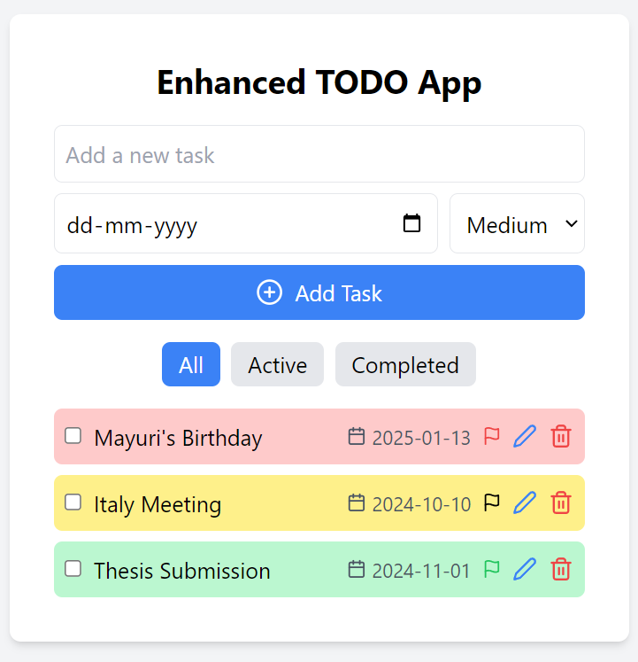

# Enhanced TODO App

A feature-rich TODO application built with React, offering intuitive task management with priorities, due dates, and filtering options. Designed for a seamless user experience, this app helps you stay organized and productive.

## Features

- **Add Tasks**: Easily add new tasks with a descriptive title.
- **Set Due Dates**: Assign due dates to your tasks to keep track of deadlines.
- **Priority Levels**: Categorize tasks by priority levels (Low, Medium, High) to manage your workload effectively.
- **Edit Tasks**: Modify task details including text, due dates, and priority levels.
- **Delete Tasks**: Remove tasks that are no longer needed.
- **Mark as Completed**: Toggle tasks as completed to visualize your progress.
- **Filter Tasks**:
  - **All**: View all tasks.
  - **Active**: View only active (incomplete) tasks.
  - **Completed**: View only completed tasks.
- **Responsive Design**: Optimized for various screen sizes to ensure accessibility on all devices.
- **User-Friendly Interface**: Clean and intuitive UI for effortless task management.



## Tech Stack

- **React**: Frontend library for building user interfaces.
- **TypeScript**: Enhances JavaScript with static type definitions for better code quality and maintainability.
- **Tailwind CSS**: Utility-first CSS framework for rapid UI development and styling.
- **Lucide React**: Icon library for visually appealing and consistent icons.
- **Fetch API**: For handling HTTP requests to interact with the backend (API details are abstracted).

## Getting Started

### Prerequisites

- **Node.js**: Ensure you have Node.js installed on your machine. You can download it from [here](https://nodejs.org/).

### Installation

1. **Clone the Repository**

   ```bash
   git clone https://github.com/your-username/enhanced-todo-app.git
   cd enhanced-todo-app

2. **Install Dependencies**
   ```bash
   npm install

3. **Start the Development Server**
    ```bash
    node server.js

4. **Run React APP**
    ```bash
    npm start
